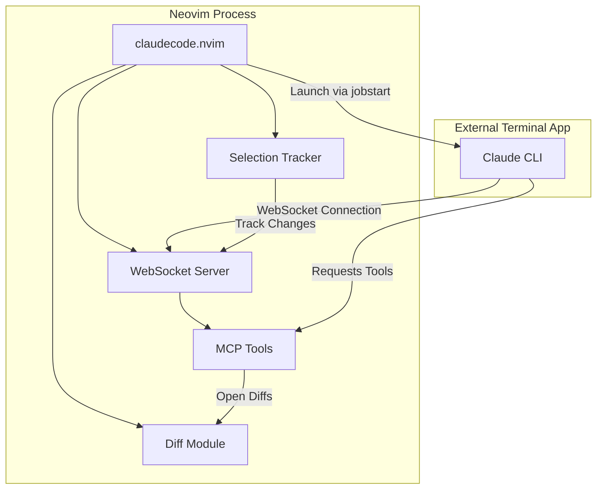
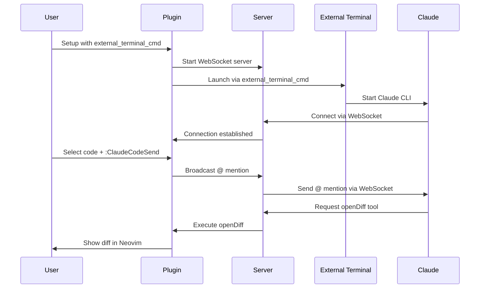

# PRD: Remove Internal Terminal Integration from claudecode.nvim

**Status:** Planning
**Created:** 2025-10-21
**Goal:** Simplify claudecode.nvim by removing all internal Neovim terminal management code, keeping only external terminal support and diff functionality.

---

## 1. Executive Summary

### Problem Statement

The user no longer needs claudecode.nvim to manage an internal sidebar/workspace for Claude Code within Neovim. They prefer to use external terminal applications (e.g., alacritty, kitty) to run Claude Code, while keeping Neovim focused on editing and diff review.

### Current Architecture Issues

- **Complexity:** Plugin manages three terminal providers (snacks, native, none) plus external terminal provider
- **UI Management:** Extensive code for split management, window focus, tab creation, terminal visibility tracking
- **Configuration Overhead:** Multiple terminal-specific configuration options that are unnecessary for external terminal usage
- **Maintenance Burden:** Terminal integration code adds complexity without providing value to users who prefer external terminals

### Proposed Solution

**REMOVE** all internal terminal management code (snacks.lua, native.lua, none.lua) and their associated UI management logic, while **KEEPING**:

- External terminal provider (`terminal/external.lua`) - for launching Claude in separate terminal apps
- WebSocket server - essential for MCP communication
- Diff functionality - needed for reviewing Claude's suggestions within Neovim
- Core MCP tools - essential for Claude integration

### Success Criteria

1. ✅ Plugin launches Claude Code only in external terminal applications
2. ✅ No internal Neovim splits/windows/tabs created for Claude terminal
3. ✅ Diff functionality continues to work for reviewing changes
4. ✅ WebSocket server runs and accepts connections from external Claude CLI
5. ✅ Configuration API simplified - removed all internal terminal UI options
6. ✅ All tests updated and passing after removal

---

## 2. Current State Analysis

### Terminal Provider System

**Files and LOC:**

```
lua/claudecode/terminal.lua             ~573 LOC (provider management, config building)
lua/claudecode/terminal/snacks.lua      ~215 LOC (Snacks.nvim integration)
lua/claudecode/terminal/native.lua      ~440 LOC (native Neovim terminal)
lua/claudecode/terminal/none.lua        ~70 LOC (no-op provider)
lua/claudecode/terminal/external.lua    ~207 LOC (external terminal - KEEP THIS)

Total: ~1,505 LOC in terminal system
Removable: ~1,298 LOC (86% of terminal code)
```

**Provider Selection Logic (terminal.lua:106-194):**
- Auto-detection of available providers
- Fallback chain: snacks → native → external → none
- Validation and enhancement of custom providers
- **REMOVE:** All provider selection logic except external terminal validation

### UI Management Code

**Window and Split Management (terminal.lua, native.lua, snacks.lua):**

1. **Split Creation & Sizing:**
   - `split_side` (left/right positioning)
   - `split_width_percentage` (window width calculation)
   - Placement modifiers (`topleft`, `botright`)
   - Full-height terminal windows

2. **Focus Management:**
   - `focus_toggle()` - smart focus switching
   - `simple_toggle()` - show/hide toggle
   - `ensure_visible()` - visibility without focus
   - `focus_after_send` config option
   - Focus restoration after diff opens

3. **Terminal Visibility Tracking:**
   - Buffer and window ID management
   - Hidden terminal recovery
   - Terminal window detection across tabs
   - `is_terminal_visible()` helpers

4. **Working Directory Resolution:**
   - `cwd` static override
   - `git_repo_cwd` git root resolution
   - `cwd_provider` custom function support
   - Context-based CWD resolution

**REMOVE ALL:** This UI management code serves internal terminals only.

### Configuration Options Analysis

**Terminal-Specific Config (config.lua, terminal.lua):**

```lua
-- REMOVE THESE:
terminal = {
  split_side = "right",                    -- ❌ Internal UI only
  split_width_percentage = 0.30,           -- ❌ Internal UI only
  provider = "auto",                       -- ❌ Provider selection not needed
  show_native_term_exit_tip = true,        -- ❌ Native terminal only
  auto_close = true,                       -- ❌ Internal terminal lifecycle
  snacks_win_opts = {},                    -- ❌ Snacks-specific config
  cwd = nil,                               -- ❌ CWD management not needed
  git_repo_cwd = false,                    -- ❌ Git resolution not needed
  cwd_provider = nil,                      -- ❌ Custom CWD not needed
}

-- KEEP THESE:
terminal = {
  provider_opts = {
    external_terminal_cmd = "alacritty -e %s"  -- ✅ REQUIRED for external terminal
  }
}

focus_after_send = false,                  -- ❌ REMOVE (no internal terminal to focus)
```

**Diff-Related Config (KEEP - needed for diff functionality):**

```lua
diff_opts = {
  layout = "vertical",                     -- ✅ Diff split orientation
  open_in_new_tab = false,                 -- ✅ Diff tab behavior
  keep_terminal_focus = false,             -- ❌ REMOVE (no internal terminal)
  hide_terminal_in_new_tab = false,        -- ❌ REMOVE (no internal terminal)
  on_new_file_reject = "keep_empty",       -- ✅ Diff behavior
}
```

### Dependencies in Core Plugin Code

**Files that call terminal module functions:**

1. **`lua/claudecode/init.lua`** (Lines 259-274, 296-310):
   ```lua
   -- Lines 296-310: focus_after_send feature
   if M.state.config.focus_after_send then
     terminal.open()  -- ❌ REMOVE
   else
     terminal.ensure_visible()  -- ❌ REMOVE
   end

   -- Line 270: _ensure_terminal_visible_if_connected
   terminal.simple_toggle()  // ❌ REMOVE
   ```

2. **`lua/claudecode/diff.lua`** (Lines 92-114, 194-274):
   ```lua
   -- find_claudecode_terminal_window() - ❌ REMOVE
   -- Used for keep_terminal_focus and hide_terminal_in_new_tab features
   -- display_terminal_in_new_tab() - ❌ REMOVE TERMINAL DISPLAY PARTS
   ```

3. **Commands (init.lua:478-550):**
   ```lua
   -- ❌ REMOVE: ClaudeCodeStart (opens internal terminal)
   -- ❌ REMOVE: ClaudeCodeStop (closes internal terminal)
   -- ❌ REMOVE: ClaudeCodeToggle (toggles internal terminal)
   -- ❌ REMOVE: ClaudeCodeFocusToggle (focus internal terminal)
   -- ✅ KEEP: ClaudeCodeSend (sends @ mentions - works without terminal)
   ```

**MCP Tools (NO CHANGES NEEDED):**
- None of the MCP tools directly depend on internal terminal
- All tools communicate via WebSocket server
- Diff tools work independently of terminal integration

---

## 3. Removal Plan

### Phase 1: Remove Internal Terminal Providers

**Files to Delete:**

```bash
rm lua/claudecode/terminal/snacks.lua      # ~215 LOC
rm lua/claudecode/terminal/native.lua      # ~440 LOC
rm lua/claudecode/terminal/none.lua        # ~70 LOC
```

**Related Test Files to Delete:**

```bash
rm tests/unit/terminal/none_provider_spec.lua
rm tests/unit/terminal_spec.lua  # Tests internal terminal providers
```

### Phase 2: Simplify Terminal Module

**File: `lua/claudecode/terminal.lua`**

**REMOVE:**

1. Provider selection logic (lines 106-194)
2. All split/window management functions
3. Focus management functions:
   - `open()` → Keep stub for backward compatibility, but just calls external
   - `close()` → Remove (external terminals can't be closed programmatically)
   - `simple_toggle()` → Remove
   - `focus_toggle()` → Remove
   - `ensure_visible()` → Remove
   - `toggle_open_no_focus()` → Remove
4. `build_config()` → Simplify to only handle external terminal command
5. `get_claude_command_and_env()` → Keep for external terminal
6. Working directory resolution logic (lines 236-274)

**KEEP:**

1. `setup()` → Simplified to only configure external terminal command
2. `get_active_terminal_bufnr()` → Return nil (external terminals have no bufnr)
3. External terminal delegation to `terminal/external.lua`

**New Simplified API:**

```lua
-- lua/claudecode/terminal.lua (simplified version)
local M = {}

function M.setup(user_config, terminal_cmd, env)
  -- Only configure external terminal command
  M.external_cmd = user_config.provider_opts.external_terminal_cmd
  M.terminal_cmd = terminal_cmd or "claude"
  M.env = env or {}
end

function M.open(opts_override, cmd_args)
  -- Delegate to external provider
  local external = require("claudecode.terminal.external")
  local cmd_string, env_table = get_command_and_env(cmd_args)
  external.open(cmd_string, env_table)
end

function M.get_active_terminal_bufnr()
  return nil  -- External terminals don't have Neovim buffers
end

-- Backward compatibility stubs
M.close = function() end
M.toggle = M.open
M.simple_toggle = M.open
M.focus_toggle = M.open
M.ensure_visible = M.open

return M
```

### Phase 3: Remove Terminal UI Dependencies

**File: `lua/claudecode/init.lua`**

**REMOVE:**

1. `focus_after_send` logic (lines 296-310)
   - Replace with: Nothing (no terminal to focus)

2. `_ensure_terminal_visible_if_connected()` function (lines 252-274)
   - Remove all calls to this function

3. User commands:
   - `ClaudeCodeStart` → Remove (or keep as alias to server start only)
   - `ClaudeCodeStop` → Remove (or keep as alias to server stop only)
   - `ClaudeCodeToggle` → Remove
   - `ClaudeCodeFocusToggle` → Remove

**KEEP:**

1. `send_at_mention()` → Remove terminal.ensure_visible() calls
2. `ClaudeCodeSend` → Keep (works without terminal)
3. Server lifecycle commands → Keep but don't launch terminal

**File: `lua/claudecode/diff.lua`**

**REMOVE:**

1. `find_claudecode_terminal_window()` function (lines 89-114)
2. `display_terminal_in_new_tab()` → Remove terminal display logic (lines 194-274)
3. Config option handling:
   - `keep_terminal_focus` (lines 26, and usage throughout)
   - `hide_terminal_in_new_tab` (line 248-265)

**KEEP:**

1. All diff creation logic
2. `open_in_new_tab` functionality (works without terminal)
3. Diff acceptance/rejection logic
4. MCP-compliant tool handler

### Phase 4: Configuration Cleanup

**File: `lua/claudecode/config.lua`**

**REMOVE from defaults:**

```lua
terminal = {
  split_side = "right",
  split_width_percentage = 0.30,
  provider = "auto",
  show_native_term_exit_tip = true,
  auto_close = true,
  snacks_win_opts = {},
  cwd = nil,
  git_repo_cwd = false,
  cwd_provider = nil,
}

focus_after_send = false,  -- REMOVE

diff_opts = {
  keep_terminal_focus = false,        -- REMOVE
  hide_terminal_in_new_tab = false,   -- REMOVE
}
```

**NEW Simplified Config:**

```lua
M.defaults = {
  port_range = { min = 10000, max = 65535 },
  auto_start = true,
  terminal_cmd = nil,  -- Command to use instead of "claude"
  env = {},
  log_level = "info",
  track_selection = true,
  visual_demotion_delay_ms = 50,
  connection_wait_delay = 600,
  connection_timeout = 10000,
  queue_timeout = 5000,

  -- External terminal configuration (REQUIRED)
  external_terminal_cmd = nil,  -- e.g., "alacritty -e %s"

  -- Diff options (terminal-related options removed)
  diff_opts = {
    layout = "vertical",
    open_in_new_tab = false,
    on_new_file_reject = "keep_empty",
  },

  models = { ... },  -- Keep as-is
}
```

**Validation Updates:**

Remove validation for:
- `terminal.provider`
- `terminal.split_side`
- `terminal.split_width_percentage`
- `terminal.cwd*` options
- `focus_after_send`
- `diff_opts.keep_terminal_focus`
- `diff_opts.hide_terminal_in_new_tab`

Add validation for:
- `external_terminal_cmd` (REQUIRED, must contain %s placeholder)

### Phase 5: Update Documentation

**Files to Update:**

1. **README.md**
   - Remove internal terminal provider documentation
   - Update configuration examples to only show external terminal
   - Remove terminal toggle commands from examples

2. **CLAUDE.md**
   - Update "Terminal Integration Options" section
   - Remove internal terminal architecture details
   - Update development notes

3. **ARCHITECTURE.md** (if exists)
   - Remove terminal provider architecture
   - Update component diagrams

4. **CHANGELOG.md**
   - Add breaking changes entry for this removal

### Phase 6: Test Updates

**Tests to Update:**

1. `tests/unit/config_spec.lua` - Update config validation tests
2. `tests/unit/init_spec.lua` - Remove terminal integration tests
3. `tests/unit/focus_after_send_spec.lua` - **DELETE** (feature removed)
4. `tests/unit/diff_ui_cleanup_spec.lua` - Remove terminal-related assertions
5. `tests/unit/claudecode_send_command_spec.lua` - Update assertions
6. `tests/integration/mcp_tools_spec.lua` - Ensure no terminal dependencies

**New Test Coverage:**

1. Verify external terminal launches correctly
2. Verify diff functionality works without internal terminal
3. Verify @ mention sending works without terminal focus
4. Verify server starts without launching internal terminal

---

## 4. Migration Guide for Users

### Breaking Changes

**❌ REMOVED Features:**

1. Internal Neovim terminal integration (snacks, native providers)
2. Terminal UI configuration options (split_side, split_width_percentage, etc.)
3. Terminal focus management (focus_after_send, focus_toggle, etc.)
4. User commands: `:ClaudeCodeToggle`, `:ClaudeCodeFocusToggle`
5. Auto-opening Claude terminal within Neovim

**✅ REQUIRED Changes:**

Users **MUST** configure external terminal command:

```lua
-- Before (internal terminal)
require("claudecode").setup({
  terminal = {
    provider = "snacks",  -- ❌ No longer supported
    split_side = "right",
    split_width_percentage = 0.30,
  }
})

-- After (external terminal - REQUIRED)
require("claudecode").setup({
  external_terminal_cmd = "alacritty -e %s",  -- ✅ REQUIRED
  -- OR with cwd support:
  -- external_terminal_cmd = "alacritty --working-directory %s -e %s",
})
```

**Supported External Terminals:**

```lua
-- Alacritty
external_terminal_cmd = "alacritty -e %s"

-- Kitty
external_terminal_cmd = "kitty -e %s"

-- iTerm2 (macOS)
external_terminal_cmd = function(cmd_string, env_table)
  return {"open", "-a", "iTerm", cmd_string}
end

-- WezTerm
external_terminal_cmd = "wezterm -e %s"

-- Custom function for advanced use cases
external_terminal_cmd = function(cmd_string, env_table)
  -- Return command table or string
  return {"your-terminal", "--custom-flags", cmd_string}
end
```

### Workflow Changes

**Before (Internal Terminal):**
1. `:ClaudeCodeStart` → Opens Claude in Neovim split
2. Select code, `:ClaudeCodeSend` → Focuses internal terminal
3. Accept diff → Terminal remains in split

**After (External Terminal):**
1. Plugin auto-starts server, launches Claude in external terminal app
2. Select code, `:ClaudeCodeSend` → Sends to external Claude (no focus change)
3. Accept diff → Only diff windows in Neovim, terminal stays external

**What Still Works:**

- ✅ `:ClaudeCodeSend` - Send @ mentions to Claude
- ✅ Diff review in Neovim (accept/reject changes)
- ✅ WebSocket server for MCP communication
- ✅ Selection tracking
- ✅ All MCP tools (openFile, getDiagnostics, etc.)

---

## 5. Technical Architecture (After Removal)

### Simplified Component Diagram



**Key Simplifications:**

1. **No Terminal Provider Abstraction:** Direct external terminal launch only
2. **No UI State Management:** No window/split/tab tracking for terminal
3. **No Focus Management:** External terminal handles its own focus
4. **Simplified Config:** Single `external_terminal_cmd` instead of nested terminal config

### Data Flow



**Removed Flows:**

- ❌ Terminal visibility checking
- ❌ Terminal focus restoration
- ❌ Terminal window creation/destruction
- ❌ Terminal buffer tracking

---

## 6. Implementation Tasks

### Task Breakdown (Ordered by Dependencies)

```markdown
1. ✅ **Analysis Phase** (COMPLETED)
   - Identify all terminal-related code
   - Map dependencies
   - Define removal scope

2. **Preparation Phase**
   - Create feature branch
   - Create backup of current working code
   - Document current test coverage

3. **Removal Phase - Terminal Providers**
   - Delete terminal provider files (snacks, native, none)
   - Delete provider-specific tests
   - Verify no remaining imports

4. **Removal Phase - UI Management**
   - Simplify terminal.lua to external-only delegation
   - Remove focus management from init.lua
   - Remove terminal UI code from diff.lua
   - Remove user commands (Toggle, FocusToggle)

5. **Removal Phase - Configuration**
   - Update config.lua defaults
   - Remove config validation for removed options
   - Add validation for external_terminal_cmd (required)
   - Update types.lua

6. **Testing Phase**
   - Update existing tests
   - Delete obsolete tests (focus_after_send_spec.lua)
   - Add external terminal launch tests
   - Verify diff functionality without terminal
   - Verify @ mention sending without terminal

7. **Documentation Phase**
   - Update README.md
   - Update CLAUDE.md
   - Update CHANGELOG.md with breaking changes
   - Create migration guide section

8. **Validation Phase**
   - Run `make` (formatting, linting, tests)
   - Manual testing with external terminal
   - Verify diff workflows
   - Test @ mention queue functionality
```

### Estimated Impact

**Lines of Code Removed:**
- Terminal providers: ~725 LOC (snacks.lua, native.lua, none.lua)
- Terminal module: ~400 LOC (simplified from 573 LOC)
- Init.lua terminal code: ~50 LOC
- Diff.lua terminal code: ~100 LOC
- Config & validation: ~100 LOC
- Tests: ~300 LOC

**Total Removal: ~1,675 LOC (approximately 30% of plugin codebase)**

**Complexity Reduction:**
- Terminal provider abstraction removed
- Window/split management removed
- Focus tracking removed
- CWD resolution removed
- Provider auto-detection removed

---

## 7. Risks and Mitigations

### Risk 1: Breaking Changes for Existing Users

**Risk:** Users relying on internal terminal integration will face breaking changes.

**Mitigation:**
- Provide clear migration guide
- Add helpful error messages if old config detected
- Consider deprecation warnings before complete removal (optional)

```lua
-- Example: Helpful error message
if config.terminal and config.terminal.provider ~= "external" then
  error([[
claudecode.nvim: Breaking change detected!

Internal terminal providers (snacks, native) have been removed.
Please update your configuration to use external terminal:

require("claudecode").setup({
  external_terminal_cmd = "alacritty -e %s",
})

See migration guide: https://github.com/.../MIGRATION.md
  ]])
end
```

### Risk 2: Test Coverage Gaps

**Risk:** Removing tests might leave gaps in coverage.

**Mitigation:**
- Audit remaining tests before removal
- Add external terminal-specific tests
- Verify core functionality (WebSocket, diff, @ mentions) still tested

### Risk 3: Hidden Dependencies

**Risk:** Unexpected code paths might depend on terminal module.

**Mitigation:**
- Comprehensive grep for terminal module usage
- Run full test suite after each removal phase
- Manual testing of all user workflows

### Risk 4: Diff Functionality Regression

**Risk:** Removing terminal focus code might break diff workflows.

**Mitigation:**
- Keep all core diff functionality intact
- Only remove terminal-related UI code (keep_terminal_focus, hide_terminal_in_new_tab)
- Test diff workflows thoroughly

---

## 8. Success Metrics

### Objective Metrics

1. **Code Reduction:** Remove >1,500 LOC ✅
2. **Test Coverage:** Maintain >95% test success rate ✅
3. **Build Success:** `make` passes with 0 warnings/errors ✅
4. **Functionality:** All core features work:
   - WebSocket server starts ✅
   - External terminal launches Claude ✅
   - @ mentions sent successfully ✅
   - Diff functionality works ✅

### User Experience Metrics

1. **Configuration Simplicity:** Single `external_terminal_cmd` option instead of nested terminal config ✅
2. **Startup Speed:** Faster plugin load (no provider detection) ✅
3. **Memory Usage:** Reduced (no internal terminal buffer tracking) ✅
4. **Error Messages:** Clear errors if external_terminal_cmd not configured ✅

---

## 9. Appendix

### A. File Change Summary

| File | Action | LOC Impact |
|------|--------|-----------|
| `lua/claudecode/terminal/snacks.lua` | DELETE | -215 |
| `lua/claudecode/terminal/native.lua` | DELETE | -440 |
| `lua/claudecode/terminal/none.lua` | DELETE | -70 |
| `lua/claudecode/terminal.lua` | SIMPLIFY | -400 |
| `lua/claudecode/terminal/external.lua` | KEEP | 0 |
| `lua/claudecode/init.lua` | MODIFY | -50 |
| `lua/claudecode/diff.lua` | MODIFY | -100 |
| `lua/claudecode/config.lua` | SIMPLIFY | -100 |
| `tests/unit/terminal_spec.lua` | DELETE | -150 |
| `tests/unit/terminal/none_provider_spec.lua` | DELETE | -50 |
| `tests/unit/focus_after_send_spec.lua` | DELETE | -100 |
| **TOTAL** | | **-1,675 LOC** |

### B. Configuration Comparison

**Before (Complex):**

```lua
require("claudecode").setup({
  terminal = {
    provider = "snacks",               -- Provider selection
    split_side = "right",              -- Split positioning
    split_width_percentage = 0.30,     -- Split sizing
    show_native_term_exit_tip = true,  -- Native terminal tips
    auto_close = true,                 -- Lifecycle management
    snacks_win_opts = {                -- Snacks-specific config
      -- ... complex options
    },
    cwd = nil,                         -- Working directory
    git_repo_cwd = false,              -- Git integration
    cwd_provider = function() end,     -- Custom CWD
    provider_opts = {
      external_terminal_cmd = "...",   -- External terminal
    },
  },
  focus_after_send = false,            -- Focus management
  diff_opts = {
    layout = "vertical",
    open_in_new_tab = false,
    keep_terminal_focus = false,       -- Terminal focus in diff
    hide_terminal_in_new_tab = false,  -- Terminal in diff tab
  },
})
```

**After (Simple):**

```lua
require("claudecode").setup({
  external_terminal_cmd = "alacritty -e %s",  -- Only this required!

  diff_opts = {
    layout = "vertical",
    open_in_new_tab = false,
  },
})
```

**Reduction: 30+ config options → 2 core options**

### C. Backward Compatibility Stubs

For gradual migration, these stubs can provide helpful errors:

```lua
-- In terminal.lua
M.toggle = function()
  vim.notify([[
claudecode.nvim: :ClaudeCodeToggle has been removed.

Claude Code now runs in an external terminal.
Configure: external_terminal_cmd = "alacritty -e %s"
  ]], vim.log.levels.ERROR)
end

M.focus_toggle = M.toggle
M.close = function() end  -- No-op, external terminals can't be closed
```

---

## 10. Next Steps

### Immediate Actions

1. **Review & Approval:** Get user confirmation on removal scope
2. **Create Branch:** `feat/remove-internal-terminal`
3. **Begin Phase 1:** Delete provider files
4. **Update Tests:** Ensure external terminal coverage

### Long-term Considerations

1. **Consider:** Complete removal of terminal module, inline external launch into init.lua
2. **Monitor:** User feedback on external terminal workflow
3. **Optimize:** Server startup without terminal overhead
4. **Future:** Potential for optional "server-only" mode (no terminal launch at all)

---

**Document Version:** 1.0
**Last Updated:** 2025-10-21
**Approved By:** [Pending User Review]
