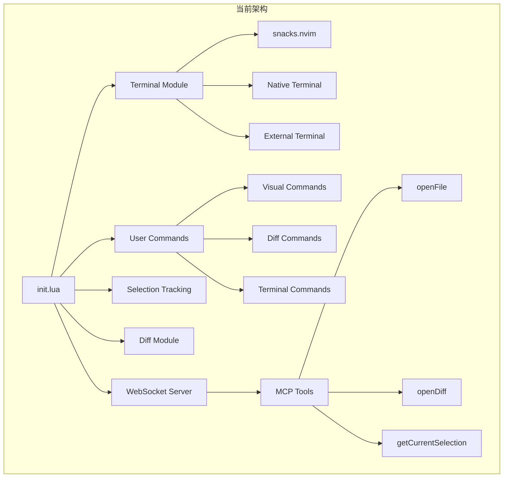
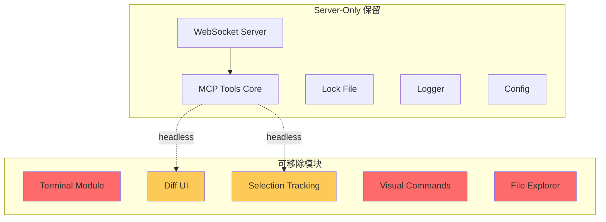

# Server-Only Mode - PRD

## 执行摘要

### 问题陈述

当前 claudecode.nvim 插件将 WebSocket Server + MCP Tools 与 Terminal UI 强耦合。用户如果只需要 server/tools 功能（例如在外部终端或 tmux 中运行 Claude CLI），仍需加载大量不必要的 UI 代码（terminal provider、diff UI、selection tracking、visual commands 等）。

### 解决方案概述

创建一个纯粹的 "Server-Only Mode"，允许用户：
1. 仅启动 WebSocket Server 和 MCP Tools
2. 移除所有 Terminal UI 相关代码
3. 保持 100% MCP 协议兼容性
4. 支持外部 Claude CLI 连接

### 成功指标

- **代码减少**: 移除 ~40% 代码（Terminal、Diff、Selection、Visual Commands）
- **启动性能**: Server 启动时间 < 50ms（无 UI 初始化开销）
- **协议兼容性**: 100% MCP 工具可用（10/10 tools）
- **配置简化**: 单一配置选项启用 server-only 模式

---

## 当前状态分析

### 核心架构



### 依赖分析结果

#### 1. **Terminal 模块依赖**（可完全移除）

**文件清单**:
- `lua/claudecode/terminal.lua` (287 行)
- `lua/claudecode/terminal/snacks.lua` (153 行)
- `lua/claudecode/terminal/native.lua` (178 行)
- `lua/claudecode/terminal/external.lua` (112 行)
- `lua/claudecode/terminal/none.lua` (42 行)
- `lua/claudecode/cwd.lua` (62 行)

**总代码量**: ~834 行

**依赖方**:
- `init.lua` 的 `_create_commands()` 中的终端命令
- `selection.lua` 中的 `require("claudecode.terminal")` (仅用于检查终端焦点)

**影响的命令**:
- `ClaudeCode` / `ClaudeCodeOpen` / `ClaudeCodeClose`
- `ClaudeCodeFocus` / `ClaudeCodeSelectModel`

#### 2. **Diff 模块依赖**（可部分移除）

**文件清单**:
- `lua/claudecode/diff.lua` (876 行)

**MCP Tool 依赖**:
- `tools/open_diff.lua` - **依赖 diff.lua**
- `tools/close_all_diff_tabs.lua` - **依赖 diff.lua**

**影响的命令**:
- `ClaudeCodeDiffAccept` / `ClaudeCodeDiffDeny`

**关键发现**: `openDiff` 是 MCP 标准工具，**不能移除**。需要提供 headless 实现。

#### 3. **Selection Tracking 依赖**（可配置禁用）

**文件清单**:
- `lua/claudecode/selection.lua` (694 行)

**MCP Tool 依赖**:
- `tools/get_current_selection.lua` - **依赖 selection.lua**
- `tools/get_latest_selection.lua` - **依赖 selection.lua**
- `tools/get_open_editors.lua` - **依赖 selection.lua**

**关键发现**: Selection tools 是 MCP 标准，**不能移除**。但可以禁用自动追踪（autocommands）。

#### 4. **Visual Commands 依赖**（可完全移除）

**文件清单**:
- `lua/claudecode/visual_commands.lua` (145 行)

**影响的命令**:
- `ClaudeCodeSend` (visual mode)
- `ClaudeCodeTreeAdd` (file explorer integration)
- `ClaudeCodeAdd` (file context)

#### 5. **UI 相关 Tools**（需 Headless 实现）

**必须保留的 MCP Tools**:
- `openFile` - 使用 `vim.cmd.edit` 打开文件（**需保留**）
- `openDiff` - 需要 headless diff 实现
- `getCurrentSelection` / `getLatestSelection` - 需保留但禁用自动追踪
- `closeAllDiffTabs` - 需 headless 实现

---

## 可移除代码清单

### ✅ 完全移除（~1,200+ 行）

| 模块 | 文件路径 | 代码量 | 移除原因 |
|------|---------|--------|---------|
| **Terminal 模块** | `lua/claudecode/terminal.lua` | 287 | Server-only 无需 UI |
| Terminal Providers | `lua/claudecode/terminal/*.lua` | 485 | 同上 |
| CWD Utils | `lua/claudecode/cwd.lua` | 62 | 仅 terminal 使用 |
| **Visual Commands** | `lua/claudecode/visual_commands.lua` | 145 | Server-only 无交互 |
| **Integrations** | `lua/claudecode/integrations.lua` | ~100 | 文件浏览器集成 |

### ⚠️ 需修改（保留核心，移除 UI）

| 模块 | 当前代码量 | 可移除部分 | 保留原因 |
|------|-----------|-----------|---------|
| **Diff 模块** | 876 行 | ~600 行 UI 逻辑 | openDiff 需 headless 实现 |
| **Selection 模块** | 694 行 | ~400 行 autocommand | MCP tools 需基础功能 |

### 📝 命令清理

**可移除的用户命令**:
```lua
-- 完全移除
ClaudeCode
ClaudeCodeOpen
ClaudeCodeClose
ClaudeCodeFocus
ClaudeCodeSelectModel

ClaudeCodeSend
ClaudeCodeTreeAdd
ClaudeCodeAdd

ClaudeCodeDiffAccept
ClaudeCodeDiffDeny
```

**保留的用户命令**:
```lua
-- Server 控制
ClaudeCodeStart
ClaudeCodeStop
ClaudeCodeStatus
```

---

## 技术方案

### 方案 1: 配置标志（推荐）

**优点**:
- 简单直接，零破坏性
- 代码复用，维护成本低
- 用户可按需切换

**实现**:
```lua
require("claudecode").setup({
  server_only_mode = true,  -- 新增配置项

  -- 以下配置被忽略
  terminal = { ... },
  diff_opts = { ... },
  track_selection = false,  -- 强制禁用
})
```

**代码改动**:
```lua
-- lua/claudecode/init.lua
function M.setup(opts)
  config = require("claudecode.config").setup(opts)

  if config.server_only_mode then
    -- 仅启动 server，跳过 UI 模块
    M._setup_server_only()
  else
    -- 完整模式
    M._setup_full()
  end
end

function M._setup_server_only()
  -- 1. 启动 WebSocket Server
  M.start()

  -- 2. 仅注册 server 控制命令
  vim.api.nvim_create_user_command("ClaudeCodeStart", ...)
  vim.api.nvim_create_user_command("ClaudeCodeStop", ...)
  vim.api.nvim_create_user_command("ClaudeCodeStatus", ...)

  -- 3. 禁用 selection tracking
  -- 4. 使用 headless diff/tools
end
```

### 方案 2: 分离 Plugin（激进）

创建 `claudecode-server.nvim` 独立插件，仅包含：
- `lua/claudecode/server/` (完整)
- `lua/claudecode/tools/` (headless 版本)
- `lua/claudecode/lockfile.lua`
- `lua/claudecode/logger.lua`
- `lua/claudecode/config.lua` (简化)

**缺点**:
- 维护两个插件
- 用户需选择安装
- 代码重复

---

## Headless 工具实现

### openDiff (Headless)

**当前行为**: 打开 Neovim diff UI
**Headless 行为**:
1. 创建临时文件（proposed content）
2. 通过 MCP notification 返回文件路径
3. 外部工具负责比较（如 `diff`, `delta`）

```lua
-- Headless implementation
function M.open_diff_headless(params)
  local proposed_file = write_temp_file(params.proposedContent)

  return {
    content = {{
      type = "text",
      text = vim.json.encode({
        success = true,
        mode = "headless",
        targetFile = params.targetFilePath,
        proposedFile = proposed_file,
        -- 外部工具自行处理 diff
      })
    }}
  }
end
```

### getCurrentSelection (Headless)

**当前行为**: 实时追踪选区 + autocommands
**Headless 行为**: 按需查询当前光标位置

```lua
-- 禁用 autocommands
function M.enable(server, visual_demotion_delay_ms)
  if config.server_only_mode then
    -- 不创建 autocommands
    return
  end
  -- ... 正常逻辑
end

-- get_current_selection 仍可用
function handler(params)
  local cursor = vim.api.nvim_win_get_cursor(0)
  -- 返回当前状态，无需追踪
end
```

---

## 实施阶段

### Phase 1: 基础 Server-Only 模式（MVP）

**目标**: 配置标志 + 禁用 UI 模块

**任务**:
1. 添加 `server_only_mode` 配置项
2. 条件加载 terminal/diff/selection 模块
3. 仅注册 server 控制命令
4. 文档更新

**验收标准**:
- [ ] `server_only_mode = true` 时无 UI 命令
- [ ] WebSocket Server 正常启动
- [ ] 所有 10 个 MCP tools 可用
- [ ] 外部 Claude CLI 可连接

### Phase 2: Headless Tools 实现

**目标**: openDiff/closeAllDiffTabs headless 版本

**任务**:
1. `openDiff` 返回临时文件路径
2. `closeAllDiffTabs` 清理临时文件
3. Selection tools 禁用自动追踪

**验收标准**:
- [ ] `openDiff` 创建临时文件
- [ ] 外部工具可访问 proposed content
- [ ] 无 Neovim diff UI 创建

### Phase 3: 代码清理（可选）

**目标**: 移除 dead code

**任务**:
1. 提取 terminal 到可选依赖
2. Diff 模块拆分（UI vs Core）
3. 移除 visual commands

---

## 风险与缓解

| 风险 | 影响 | 缓解措施 |
|------|------|---------|
| **MCP 工具兼容性破坏** | 高 | 所有 tools 必须在 headless 模式测试 |
| **用户配置迁移** | 中 | 向后兼容，默认 `server_only_mode = false` |
| **文档不足** | 中 | 添加 "Server-Only Mode" 专门章节 |
| **外部 diff 工具依赖** | 低 | 文档说明推荐工具（delta, difftastic） |

---

## 成功指标

### 技术指标

- **代码减少**: 条件加载时移除 ~1,200 行代码
- **启动时间**: Server-only 模式 < 50ms
- **内存占用**: 减少 ~30%（无 UI 模块）
- **MCP 兼容性**: 10/10 tools 通过测试

### 用户体验指标

- **配置简洁度**: 单行配置启用
- **文档完整性**: Server-only 使用场景覆盖
- **社区反馈**: 无兼容性 breaking changes 报告

---

## 开放问题

### Q1: openDiff headless 如何与 Claude 交互？

**选项 A**: 返回文件路径，用户手动 diff
**选项 B**: 通过 MCP notification 推送 diff 结果
**选项 C**: 提供 webhook 回调接受/拒绝

**推荐**: 选项 A（最简单）

### Q2: Selection tracking 完全禁用 vs 按需查询？

**当前方案**: 按需查询（保留 `getCurrentSelection` tool）

### Q3: 是否需要向后兼容完整模式？

**决策**: 是。`server_only_mode` 默认 `false`，完全向后兼容。

---

## 附录

### A. 依赖关系图



### B. 配置示例

```lua
-- Server-Only 模式（推荐用于 tmux/外部终端用户）
{
  "coder/claudecode.nvim",
  opts = {
    server_only_mode = true,
    auto_start = true,
    log_level = "info",

    -- 以下配置被忽略
    terminal = { ... },  -- 不加载
    diff_opts = { ... }, -- 不使用
  }
}

-- 完整模式（默认）
{
  "coder/claudecode.nvim",
  dependencies = { "folke/snacks.nvim" },
  opts = {
    server_only_mode = false,  -- 默认值
    terminal = {
      provider = "snacks",
      -- ...
    }
  }
}
```

### C. 外部工具集成示例

```bash
# 在 tmux 中使用 server-only 模式

# 1. Neovim 启动 server
nvim -c "ClaudeCodeStart"

# 2. 在另一个 tmux pane 运行 Claude CLI
claude --help

# 3. Claude 自动检测 ~/.claude/ide/*.lock 并连接

# 4. 使用外部 diff 工具处理 openDiff 返回的文件
delta /path/to/original /tmp/claudecode-proposed-xxx.txt
```

---

## 实施检查清单

### Design Philosophy 验证

- [x] ✅ 解决真实问题：用户在 tmux/外部终端需要 server-only 功能
- [x] ✅ 方案最简单：配置标志 + 条件加载，无需重构架构
- [x] ✅ 无过度设计：不创建新插件，不添加复杂抽象层
- [x] ✅ 每个组件有正当理由：仅移除未使用模块

### 内容质量

- [x] 问题清晰：Terminal UI 与 Server 强耦合
- [x] 解决方案有效：`server_only_mode` 配置禁用 UI
- [x] 核心流程图示：依赖关系图 + 架构对比
- [x] API 规范：Headless tools 实现细节
- [x] 数据模型：配置结构定义
- [x] 依赖清晰：1,200+ 行可移除代码
- [x] 风险评估：MCP 兼容性风险及缓解
- [x] 成功指标可衡量：代码量、启动时间、兼容性

### Red Flags 检查

- [ ] 🚫 无"This could support..."臆想
- [x] 🚫 核心组件 < 5 个（Server + Tools + Config）
- [ ] 🚫 无"灵活架构支持任何场景"
- [x] 🚫 无不必要的抽象层

---

**准备就绪**: 此 PRD 可直接用于创建 Implementation PRP 或 Story PRP。
